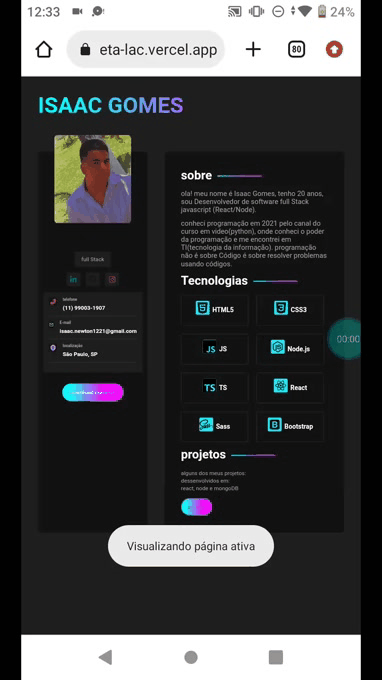

<h1 style="text-align: center">projeto</h1>

 

link <a href="https://portifolio-zeta-lac.vercel.app/">https://portifolio-zeta-lac.vercel.app/</a>

<h2 style="margin-top: 20px">Tecnologias</h2>
<ul>
  <li>react</li>
  <li>react-icons</li>
  <li>sass</li>
</ul>

<h2 style="margin-top: 20px">Funcionalidades</h2>
<ul>
  <li>navegação</li>
  <li>baixar curriculo</li>
  <li>ver redes</li>
</ul>

<h2 style="margin-top: 20px">como rodar</h2>
<ul>
   <li>git clone https://github.com/isaac545454/portifolio</li>
   <li>yarn intall(baixar o node_modules)</li> 
   <li>yarn dev(rodar o projeto)</li> 
</ul>
